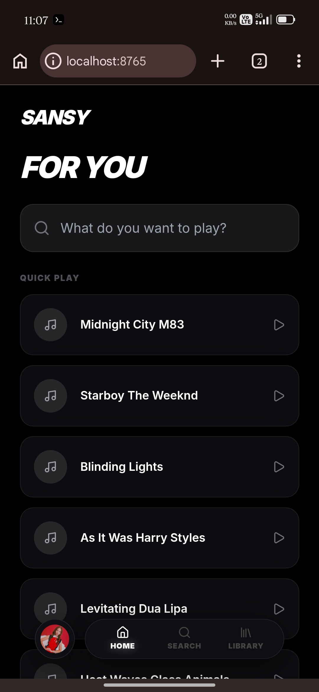
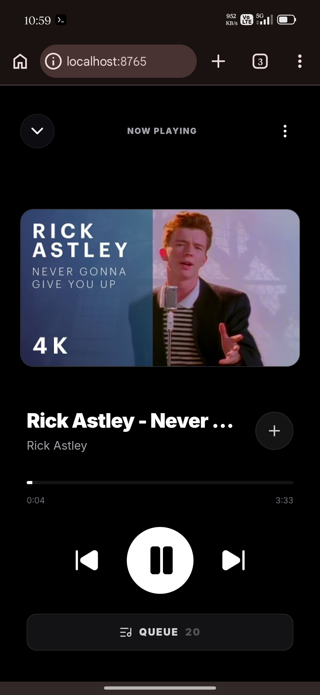
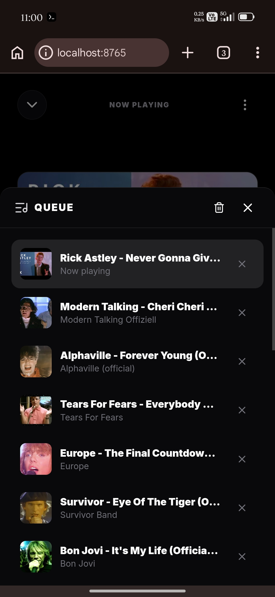
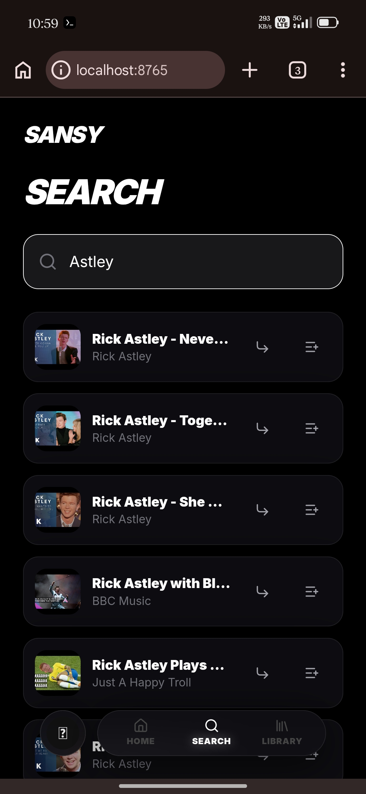
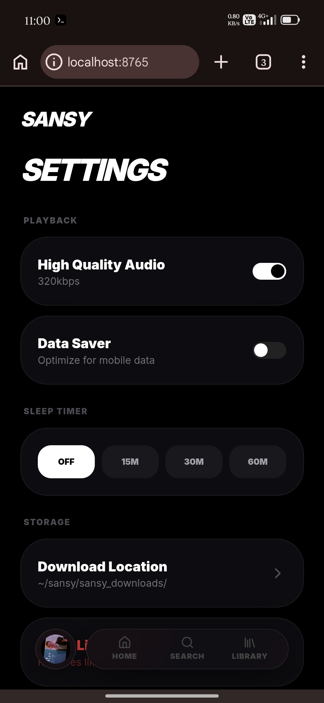
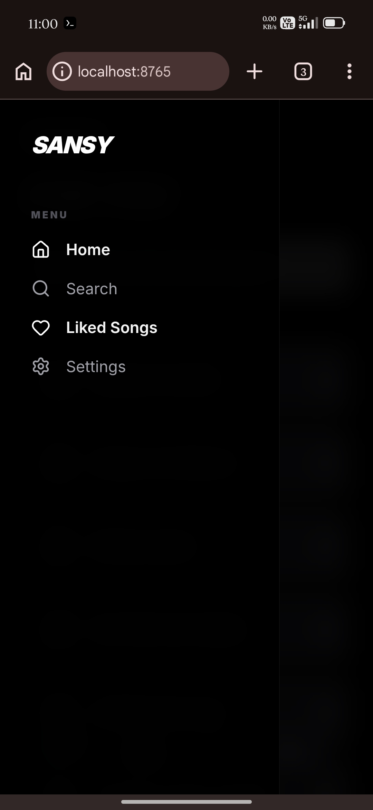

<div align="center">

# "<u>Sansy Web</u>"

**A mobile-first music streaming web app powered by Flask and yt-dlp.**


</div>

---

## "<u>About</u>" :

**Sansy Web** is an experimental music streaming web app.

It uses a **Flask backend** to search and stream audio from YouTube using `yt-dlp`, while the frontend provides a clean mobile-first music player interface.

The goal of the project is simple: To make a lighweight music app (but only web-app now though) that feels smooth, fun, and alive instead of overcomplicated.

Most of this work is buit using AI my role is to explore ideas and explain those ideas to AI to make things happen. 

I will be gratefull if someone who have real app dev background contributes to convert this web-app prototype into real working app.

---

## "<u>Features</u>":

### <i>Current Features</i> :

- Search songs using YouTube / YouTube Music
- Stream audio through Flask proxy
- Mobile-first black glass UI
- Full-screen now-playing player
- Play / pause controls
- Skip forward / backward
- Seekable progress bar
- Liked songs using browser `localStorage`
- Related tracks API
- Simple file-based cache
- API rate limiting

---
# "<u>Screenshots</u>":

<p align="center">






</p>


---
## '<u>Tech Stack</u>'

### <i>Backend</i> :

- Python
- Flask
- Flask-CORS
- Flask-Limiter
- yt-dlp
- requests

### <i>Frontend</i> :

- HTML
- CSS
- Tailwind CDN
- Vanilla JavaScript
- Lucide icons
- Browser localStorage

---

## Project Structure

```txt
sansy-web/
 │ 
 ├───README.md
 ├───requirements.txt 
 ├───.vscode/
 │      └───settings.json     
 ├───app/
 │   ├─.gitignore
 │   ├─app.py  
 │   ├─services/
 │   │    ├─cache.py
 │   │    └─youtube.py      
 │   ├─static/
 │   │   ├─index.html  
 │   │   └─js/
 │   │     ├─core.js
 │   │     ├─home.js
 │   │     └─search.js        
 │   ├──templates/
 │   │   ├─base.html
 │   │   ├─home.html
 │   │   ├─library.html
 │   │   ├─search.html
 │   │   └─settings.html    
 │   └──test/
 │        └tests.py  
 └─assets/
     └─Images/
        ├─Home.jpg
        ├─Player.jpg
        ├─Queue.jpg
        ├─Search.jpg
        ├─Settings.jpg
        └─SideBar.jpg

```

---


## "<u>Backend API</u>"

### <i>Root</i> :

```http
GET /api
```
* Returns backend info.

---

### <i>Search</i> :

```http
GET /api/search?q=<query>&limit=<number>
```

*Example* :

```http
GET /api/search?q=starboy&limit=10
```

* Searches songs using `yt-dlp`.

---

### <i>Audio Proxy</i> :

```http
GET /api/proxy/<video_id>
```

* Streams audio for a valid YouTube video ID.

---

### <i>Related Tracks</i> :

```http
GET /api/related/<video_id>?limit=20
```

* Returns related tracks for a song.

---

### <i>Playlist</i> :

```http
GET /api/playlist?url=<youtube_playlist_url>
```

Extracts tracks from a YouTube or YouTube Music playlist.


---


## "<u>Installation</u>" :

Clone the repo :

```bash
git clone https://github.com/ssannssarr/sansy-web.git
cd sansy-web
```

Create virtual environment :

```bash
python -m venv venv 
```

Activate it :

```bash
# Linux / macOS
source venv/bin/activate

# Windows
venv\Scripts\activate
```

Install dependencies :

```bash
pip install -r requirements.txt
```

Run the app:

```bash
python app/app.py
```

Open:

```http
http://localhost:8765
```

For phone testing on same Wi-Fi:

```http
http://YOUR_LOCAL_IP:8765
```

---

## "<u>Termux Setup</u> :

```bash
pkg update && pkg upgrade
pkg install python git
git clone https://github.com/ssannssarr/sansy-web.git
cd sansy-web
python -m venv venv
source venv/bin/activate
pip install -r requirements.txt
python app/app.py
```

Then open :

```http
http://localhost:8765
```

---

## "<u>Current Status</u>" :

Sansy Web is still a **prototype**.

### <i>Working </i>:

* Flask backend
* Search API
* Audio proxy
* Web player UI
* Liked songs
* Settings UI
* Basic caching
* Related tracks endpoint


### <i>Needs Work</i> :

* Better playlist UI
* Better queue handling
* Proper frontend file separation
* Remove duplicate inline JS if `core.js` is used
* Add tests
* Add deployment guide
* Improve error handling

---

## "<u>Important Notes</u>":

This project depends on `yt-dlp`.

If search or streaming breaks, update it :

```bash
pip install -U yt-dlp
```

YouTube changes may break extraction sometimes.

---

## "<u>Contributing</u>":

* **Contributions are welcomed.**

<b>**"**</b> *EVERYONE IS WELCOMED FOR CONTRIBUTION. BEFORE CONTRIBUTING PLEASE READ THE <a href="./assets/contribution.md">CONTRIBUTION GUIDE</A>.*<B>**"**</B>

---

## "<u>Disclaimer</u> :

Sansy Web is made for learning and experimentation.

Respect YouTube’s terms of service and local laws when using or modifying this project.

---
<h2 align="center"><i>"THANK YOU FOR READING UPTO HERE"</i></h2>


